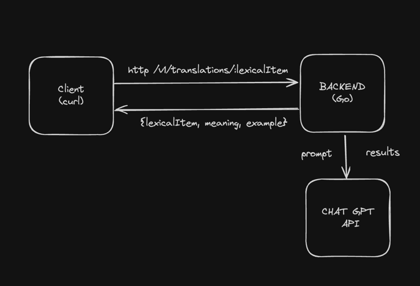

# How to integrate Golang Service with Chat GPT API.

## Intro
In this tutorial we're going to create a Golang service that communicates with Chat GPT API. After watching this video you should be able to understand how to do it and change the logic for implementing your own use cases.

## Considerations
For implementing solution we need to have:
1. API Key to Chat GPT API and at the moment Chat GPT doesn't provide free trial, so you'll have to setup your Open API account and pay X per token. But for a pet project it's quite fair price in my opinion.
2. Golang installed.

## What we'll try to develop?
Essentially to get familiar with Chat GPT API we'll try to create a smart dictionary. As an input we'll send a http request with a lexical item and in response we get the meaning, examples of usages.
Architecture will consist of 2 components:
- Backend - Golang application with Echo web framework.
- Chat GPT API that Open AI provides.



## How to run
1. Specify env variables `CHAT_GPT_API_URL` and `CHAT_GPT_API_KEY`
2. Start the server
```bash
go run ./cmd/main.g
```
3. Test with curl
```curl
curl localhost:8080/v1/translations/feasible
```

Response example:
```json
{
   "lexicalItem":"feasible",
   "meaning":"possible to do easily or conveniently",
   "example":"Given our limited resources, it may not be feasible to launch a new product at this time."
}
```

## Other materials:
- introduction to openai api: https://platform.openai.com/docs/introduction
- quick start with python: https://platform.openai.com/docs/quickstart?context=python
- check token price: https://platform.openai.com/tokenizer
- chat gpt api pricing: https://openai.com/pricing